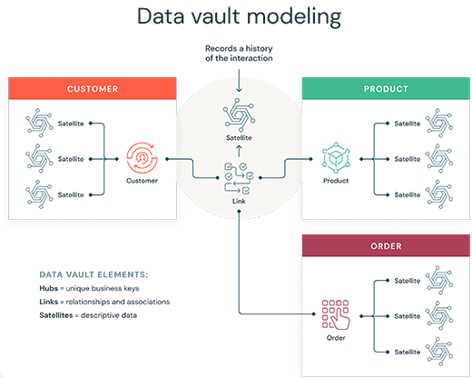
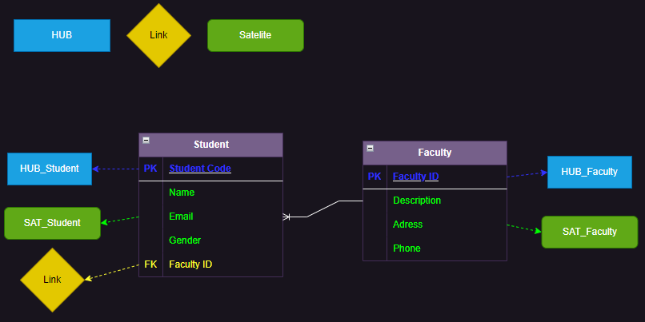
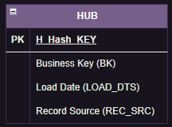
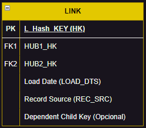
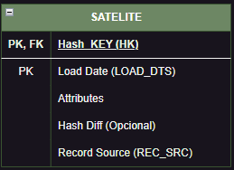

# Data Vault

Foi desenvolvido para resolver problemas orientados a assuntos, incluindo agregações, alteração estrutural do modelo de dados, desempenho de consultas, informações reutilizáveis ou compartilhadas e a capacidade de oferecer suporte ao processamento analítico.

Data Vault é uma nova abordagem de design inventada por Dan Linsdet:

> Conjunto de tabelas normalizadas, orientado para detalhes, com rastreamento histórico e vinculado de forma exclusia, que oferece suporte a uma ou mais áreas funcionais da empresa. É uma abordagem híbrida que engloba o que há de melhor entre os esquemas 3NF e Star Schema.

---

## Introdução

**Data Vault 1.0**

* Focado no Data Vault Modelling

**Data Vault 2.0**

* Performance e Escalabilidade
* Melhores práticas de Scrum e Agile
* NoSQL e sistemas de Big Data

O Data Vault não é apenas uma técnica, é uma metodologia completa para projetos de data warehouse. É composto pelas tabelas Hub, Link e Satélite.

* **Hub**: representa chaves de negócios que são identificadas exclusivamente com uma tendência muito baixa de mudança;
* **Link**: representa o relacionamento entre os Hubs;
* **Satélites**: inclui atributos descritivos de tabelas de Hubs e Link, e consiste em dados que tendem a mudar com o tempo.

O Data Vault é uma metodologia inovadora de modelagem de dados para plataformas de armazenamento de dados em grande escala. Ele foi desenvolvido especificamente para tratar de problemas de agilidade, flexibilidade e escalabilidade encontrados em outras abordagens de modelagem de dados.

Ele foi criado para ser um repositório histórico granular, não volátil e auditável de dados corporativos. Ele suporta entregas incrementais e funciona bem com sistemas origem que sofrem alterações frequentemente.

Data Vault 2.0 possui suporte a paralelização por conta do uso de hash keys.

Ferramentas que ajudam a desenvolver o data vault:

* WhereScape
* Quippu
* BI Ready
* AnalytiX DS
* Rapid Ace

Algumas desvantagens do Data Vault:

* As tabelas são separadas/ normalizadas pela distribuição de relacionamentos (links), chaves de negócio (hubs) e atributos (satélites) em tabelas diferentes, gerando um volume maior de tabelas para fazer Join;
* É pouco prático para fazer direct query (usuários mais básicos) e identificar a versão correta dos dados;
* Devido a estrutura normalizada em 3 tabelas, requer mais storage em disco.

Se estivermos falando de cenários menores, envolvendo poucas fontes de dados e um time pequeno, a abordagem tradicional de Data Warehouse (Inmon e Kimbal) é mais adequada.

---

## Definições Técnicas

**Hub**

Lista única de business key.

**Link**

Lista única de relacionamentos (n to n) entre business key.

**Satélite**

Contém dados históricos descritivos associados com Hubs e Links.

Exemplo:

---

### Hub Tables

* **Primary Key (H_Hash_KEY)**: hash identificador único (hash value da business key). Surrogate Keys substituídas por hash-based primary keys no DV 2.0;
* **Business Key**: BK pode ser uma chave natural ou composta;
* **Load Date**: Geralmente, a data em que a BK entrou/ foi inserida no DW. Esse campo é criado e nunca é alterado ou deletado;
* **Record Source**: informa o sistema de origem da BK, fornecendo o rastreio do dado.

Outras considerações sobre Hubs:

* A Entidade Hub nunca deve conter foreign-keys;
* Hubs podem ser "pai" de outras tabelas, mas nunca ser "filho" de outra tabela;
* Deve ter pelo menos 1 satélite;
* Ralacionamento direto Hub-to-Hub não é permitido;
* Hub BK e PK nunca mudam.

---

### Link Tables

Unem o Hub a outros Hubs, representando relacionamentos, transações e hierarquias entre eles.

* **Primary Key (L_Hash_KEY)**: Novo Hash Value baseado nas BKs dos Linked Hubs (cuidado! É baseado nas BKs dos Hubs, não nas HKs).

Outras considerações sobre Link Tables:

* A Link Table nunca deve conter Natural Business Keys, ou datas de início e fim (como em Slowly Changing Dimension tipo 2);
* Link Hub Tables: Link Tables não contém informações descritivas;
* Links existem no mais baixo nível de granularidade;
* Links sempre são N-M;
* Satelites são opcionais para Links (exceto para links hierárquicos);
* Links podem se conectar a outros Links.

---

### Satellite Tables

Os satélites fornecem informações descritivas de Hubs e Links.
O objetivo principal do satélite é rastrear o histórico do sistema, capturando todas as alterações que ocorrem nos dados descritivos.

Portanto, a estrutura e o conceito são muito parecidos com uma Slowly Changing Dimension tipo 2.

Um satélite pode ser anexado a um hub ou um link, mas, em qualquer caso, ele deve ter apenas uma tabela principal.

> Um Hub pode ter 1 ou vários satélites, mas um satélite não pode ser um pai de nenhuma outra tabela.

* **Primary Key (Hash_KEY)**: O satélite não tem sua própria chave de hash, ele contém o Hash Key da tabela pai (que pode ser um Hub ou um Link). Além disso, o Load Date também compõe a chave primária do Satélite.

Outras considerações sobre Satellite Tables:

* Um Satélite pode ter um e somente um parent table;
* O Satélite nunca deve conter foreign-keys;
* PK = HK + Load Date
* Dados existentes nunca são atualizados ou deletados;
* Dividir os Satélites por:
    * Data Source;
    * Frequência de atualização (evitar armazenamento redundante);
    * Data Types.