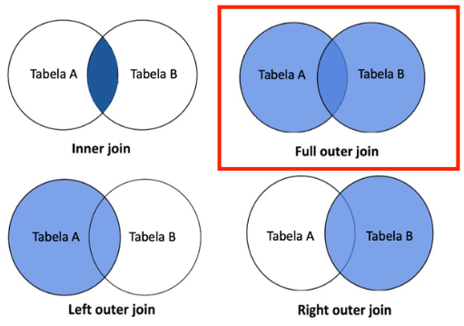
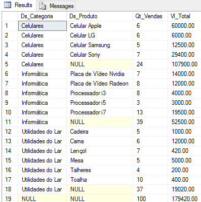
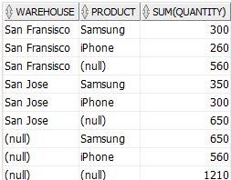
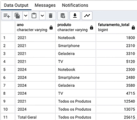
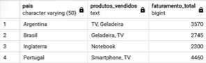

# SQL para Análise de Dados e Data Science

Arquitetura utilizada para os estudos:


* Plataforma = AWS
* SGBD = PostgreSQL
* IDE = pgAdmin
* Infraestrutura = Terraform
* Backend Terraform = S3

## Criando e Destruindo a Infraestrutura

> **Pré-requisistos**
>
> * Instalar o Terraform;
> * Ter uma conta na AWS;
> * Criar um usuário programático no AWS IAM com par de chaves (Secret + Access Key);
> * Conceder acessos de criação de recursos de rede, security group e RDS para o user.

Para criar sua infraestrutura:

* Acesse o arquivo `./infraestrutura/backend.tf` e altere o nome do Bucket onde o tfstate do Terraform será salvo para um bucket pessoal seu;


* Insira sua Access Key e Secret Key no arquivo `meu_computador/seu_usuario/.aws/Credentials`;
* No repositório `./infraesturtura` execute os seguintes comandos:

```bash
terraform init

terraform plan

terraform apply --auto-approve
```

Quando terminar os estudos, destrua a infraestrutura com o seguinte comando:

```bash
terraform destroy --auto-approve
```

---

## Teoria

### Anatomia de uma Query SQL

**Plano de Execução de uma Query**: procedimento/sequência a ser executada (anatomia) em uma query;

* FROM
* ON
* JOIN
* WHERE
* GROUP BY
* WITH CUBE OU WITH ROLLUP
* HAVING
* SELECT
* DISTINCT
* ORDER BY

Porém, a sequência pode variar em alguns casos, como quando o otimizador de consultas do SQL Server usa índices.

---

### Tipos de dados

**Quantitativos**

São aqueles que expressam uma quantidade e podem ser mensurados em escala numérica. Os dados quantitativos podem ser divididos em:

* **Discretos**: resultados de contagens e só assumem valores inteiros;
* **Contínuos**: mensurações que podem assumir qualquer valor real em um intervalo.

**Qualitativos**

Representam características que não podem ser medidas em uma escala numérica, mas podem ser categorizadas ou descritas. São classificados em:

* **Nominais**: representam categorias sem uma ordem implícita. Por exemplo: cor dos olhos (azul, verde, castanho), tipo sanguíneo (A, B, AB, O), marcas de carros (Ford, Toyota, Honda);
* **Ordinais**: representam categorias com uma ordem ou graduação específica. No entanto, a distância entre as categorias não é uniforme ou conhecida. Exemplos incluem níveis de escolaridade (fundamento, médio, superior), graus de satisfação em uma pesquisa (insatisfeito, indiferente, satisfeito) e classificações (primeiro, segundo, terceiro);


---

### Categorização

A categorização em variáveis numéricas, no contexto da análise de dados, refere-se ao processo de transformar dados numéricos contínuos ou discretos em categorias ou grupos discretos. Esse processo é também frequentemente chamado de "binning" ou "bucketing".

A ideia é simplificar a análise ou visualização de distribuições numéricas, ou preparar os dados para algoritmos que operam melhor com dados categóricos.

Razões para categorizar variáveis numéricas:

* **Simplificação de análise**: categorizar dados numéricos pode simplificar a interpretação, especialmente quando há uma grande variedade de valores numéricos;

* **Visualização**: em alguns casos, é mais intuitivo visualizar dados categóricos do que dados numéricos contínuos (Histogramas, por exemplo);

* **Tratamento de Outliers**: a categorização pode ajudar a lidar com outliers, agrupando valores extremos em categorias mais amplas;

* **Preparação para Modelos Específicos**: alguns modelos de machine learning podem exigir, ou operar melhor, com características em vez de numéricas.

O processo de categorização em variáveis numéricas geralmente envolve:

* **Definição de Intervalos**: escolher os limites que definirão as categorias. Isso pode ser feito com base em intervalos de igual tamanho, percentis ou utilizando conhecimento específico do domínio;

* **Transformação**: convertendo valores numéricos nas categorias definidas com base nos intervalos escolhidos;

* **Rotulação (opcional)**: em vez de usar os intervalos como rótulos, pode-se atribuir rótulos mais descritivos às categorias, como "baixo", "médio" e "alto".

---

### Codificação/ Encoding

No contexto da análise de dados e processamento de dados para modelagem preditiva ou machine learning, "codificação" ou "encoding" refere-se ao processo de converter dados categóricos ou textuais em um formato numérico que pode ser usado por algorítmos.

Existem várias técnicas de codificação e a escolha da técnica pode depender da natureza dos dados e do algoritmo específico que se planeja usar. Algumas das técnicas de codificação mais comuns incluem:

* **Codificação One-Hot**: cada categoria de uma variável é convertida em uma nova coluna binária (0 ou 1);


* **Codificação por Rótulo**: cada categoria recebe um valor inteiro. Esta abordagem pode ser problemática para algoritmos que interpretam a natureza ordinal dos números, a menos que haja uma ordem inerente às categorias;

* **Codificação por Frequência ou Contagem**: categorias são codificadas com base em sua frequência ou contagem no dataset. Isso pode ser útil quando uma categoria particular tem significado por sua prevalência, mas pode ser problemático se as frequências forem muito semelhantes entre categorias;

* **Codificação Target**: categorias são codificadas com base na média do valor alvo para essa categoria. Por exemplo, em um problema de classificação binária, as categorias podem ser codificadas pela média de resultados positivos para cada categoria;

* **Codificação Binária**: combina a codificação one-hot e a codificação por rótulo, representando os rótulos codificados numericamente em formato binário;

* **Codificação Baseada em Aprensizado (Embedding Encoding)**: usada principalmente com redes neurais, onde categorias são representadas como vetores densos em um espaço n-dimensional. Estes vetores são aprendidos durante o treinamento da rede neural. Essa técnica é usada em Inteligencia Artificial.

Ao escolher uma técnica, é importante considerar o tipo de modelo a ser usado, a relação entre a característica categórica e a variável alvo, e o potencial de introduzir ruído ou multicolinearidade nos dados.

Em alguns casos, pode ser benéfico experimentar várias técnicas de codificação para determinar qual oferece o melhor desempenho para um modelo específico.

---

### Binarização

No contexto de análise e processamento de dados, refere-se ao processo de converter dados numéricos ou categóricos em formato binário, ou seja, em valores 0 ou 1. Isso pode ser útil por diversas razões, incluindo a simplificação de dados, preparação para certos algoritmos ou até mesmo a extração de características relevantes de imagens em processamento de imagens.


Contextos em que a binarização é aplicada:

* **Análise e Processamento de Dados**: converter variáveis contínuas em formatos binários com base em um limiar. Por exemplo, converter uma variável como "idade" em "maior de 18 anos" (1 se verdadeiro, 0 se falso);

* **Processamento de Imagens**: envolve a conversão de imagens em tons de cinza para imagens binárias, onde os pixels são marcados como 0 (preto) ou 1 (branco) com base em um limiar de intensidade. Isso é útil para o reconhecimento de padrões e outras tarefas;

* **Preparação de Dados para Modelagem**: certos algorítmos, especialmente ous mais simples ou aqueles baseados em árvores, podem se beneficiar da simplificação de dados contínuos em formatos binários. A binarização pode ajudar a destacar relações não lineares entre características e a variável alvo;

* **Engenharia de Características (Feature Engineering)**: as criações de novas características binárias pode ajudar a destacar determinadas relações nos dados. Por exemplo, a partur de uma variável média de renda, criar uma característica binária "renda_acima_da_média" que indica se a renda de um indivíduo está acima da média da amostra.

Ao realizar a binarização, é importante escolher limiares ou critérios apropriados para a conversão, para que a informação útil não seja perdida e para que a transformação seja relevante para o objetivo da análise ou modelagem.

---

## Label Encoding x One-Hot Encoding

Label Encoding e One-Hot Encoding são técnicas utilizadas para converter variáveis categóricas em uma forma numérica que modelos de aprendizado de máquina podem entender. A escolha entre essas técnicas depende muitas vezes da natureza da variável categórica e do modelo específico que você está utilizando.

Em Label Encoding, a cada categoria é atribuído um valor único, entre 1 e N.

**Vantagens**:

* Economiza espaço, pos você tem apenas uma coluna com valores inteiros em vez de várias colunas binárias;

* Pode ser útil para modelos baseados em árvore (como árvores de decisão e random forests) que são capazes de lidar com variáveis categóricas codificadas dessa forma.

**Desvantagens**:

* Introduz uma ordem arbitrária às categorias, o que pode não ser representativo da natureza da variável. Por exemplo, se tivermos uma variável "cor" com valores "vermelho", "azul" e "verde", e elas são codificadas como 1, 2 e 3 respectivamente, isso pode sugerir que "verde" (3) é de alguma forma "maior" ou "melhor" que "azul" (2) e "vermelho" (1), o que pode não ser verdadeiro e pode levar a resultados indesejados em alguns modelos.


Em One-Hot Encoding, para cada categoria da variável categórica, é criada uma nova coluna binária chamada de `variável dummy`. Para um dado registro, a coluna correspondente à sua categoria recebe o valor 1 e todas as outras colunas recebem o valor 0.


**Vantagens**:

* Não introduz uma ordem arbitrária às categorias;

* É útil para muitos modelos lineares, redes neurais e outros modelos que não tratam bem variáveis categóricas com Label Encoding.

**Desvantagens**:

* Pode aumentar significativamente a dimensionalidade do dataset, especialmente quando a variável categórica tem muitos valores;

* A escolha entre Label Encoding e One-Hot Encoding deve ser feita com base no tipo de modelo que se planeja usar e na natureza da variável categórica.

---

## Joins

**FULL JOIN** ou **FULL OUTER JOIN**, combina registros de duas tabelas de modo que você obtenha todos os registros de ambas.



O **CROSS JOIN** produz o produto cartesiano de duas tabelas. Isso significa que ele combina cada linha da primeira tabela com cada linha da segunda tabela.

O **SELF JOIN** é uma técnica onde uma tabela é unida a si mesma. É usado para encontrar e combinar registros dentro da mesma tabela que compartilham alguma característica em comum.

> **Obs.:** sintaticamente, o `SELF JOIN` é escrito apenas como `JOIN`, e na prática, quando não informamos o tipo de join, é aplicado `INNER JOIN`.
>
> ```sql
> SELECT <campos>...
> FROM tabela as t1
> JOIN tabela as t2
> ON <condicoes>
> ```

---

## Union e Union All

São operadores em SQL usados para combinar resultados de dias ou mais consultas em um único conjunto de resultados.

O **UNION** combina os resultados de duas consultas e reomve quaisquer linhas duplicadas para produzir um conjunto de resultados únicos. As colunas e os tipos de dados nas consultas que estão sendo unidas devem ser os mesmos para que o UNION funcione.

O **UNION ALL**, por outro lado, combina os resultados de duas consultas e inclui todas as linhas, incluindo duplicatas. Ele é frequentemente mais rápido do que o UNION poruqe não precisa verificar a unicidade das linhas.

---

## Boas práticas com Joins

1. Seja específico: evite usar `SELECT *` quando fizer junções. Em vez disso, selecione apenas as colunas necessárias. Isso pode melhorar o desempenho da consulta e reduzir a carga sobre o banco de dados;

2. Use Aliases para tabelas: ao trabalhar com múltiplas tabelas, usar aliases torna a consulta mais legível e evita ambiguidades;

3. Especifique o tipo de junção: existem diferentes tipos de joins, como `INNER JOIN`, `LEFT JOIN`, `RIGHT JOIN` e `FULL JOIN`. Sempre especifique o tipo de junção que você pretende usar;

4. Use junções com base em colunas indexadas: sempre que possível, realize joins usando colunas que possuem índices. Isso pode acelerar significativamente o desempenho da consulta;

5. Evite junções cruzadas: uma junção cruzada `CROSS JOIN` retorna o produto cartesiano de duas tabelas, o que pode resultar em um número muito grande de registros e potencialmente sobrecarregar o sistema;

6. Use condições de junção claras: certifique-se de que as condições de junção sejam claras e precisas;

7. Cuidado com junções de auto-referência: ao fazer `SELF JOIN`, seja cauteloso e use aliases para diferenciar entre as "cópias" da tabela;

8. Teste sua consulta em um ambiente seguro: antes de executar consultas complexas em um ambiente de produção, teste-as em um ambiente de desenvolvimento ou em um subconjunto de dados para garantir que elas funcionem como esperado;

9. Monitore o desempenho: use ferramentas e recursos deo banco de dados para monitorar o desempenho das consultas. Se uma consulta com join estiver demorando muito para ser executada, considere otimizá-la ou consultar o administrador do banco de dados;

10. Entenda a modelagem dos dados: familiarize-se com o esquema do banco de dados, relacionamentos e chaves estrangeiras. Isso ajudará a criar junções corretas e eficientes;

11. Evite junções desnecessárias: se você não precisa de dados de uma tabela específica para satisfazer sua consulta, evite juntá-la. Junções desnecessárias podem adicionar sobrecarga sem valor.

---

## Agregações Avançadas

### Rollup

É uma extensão do group by, utilizado principalmente para realizar análises agregadas e multidimensionais, como relatórios sumarizados ou subtotais.

Exemplo:
```sql
SELECT 
    B.Ds_Categoria,
    B.Ds_Produto,
    COUNT(*) AS Qt_Vendas,
    SUM(B.Preco) AS Vl_Total
FROM 
    #Vendas A
    JOIN #Produtos B ON A.Cd_Produto = B.Codigo
GROUP BY
    ROLLUP(B.Ds_Categoria, B.Ds_Produto)
```



---

### Cube

O operador `CUBE` em SQL é uma extensão da cláusula `GROUP BY` que facilita análises multidimensionais avançadas, como relatórios com múltiplas combinações de subtotais e totais gerais.

Diferente do `ROLLUP`, que cria subtotais em uma hierarquia sequencial, o `CUBE` gera todas as combinações possíveis de subtotais para as colunas especificadas.

Por exemplo, se você usa `CUBE` com as colunas A, B e C (`GROUP BY CUBE(A, B, C)`), ele retornará subtotais para A, B, C, A+B, A+C, B+C, A+B+C e também um total geral.

Exemplo:

```SQL
SELECT
   warehouse,
   product,
   SUM(quantity)
FROM
   inventory
GROUP BY
   CUBE(warehouse,product)
ORDER BY
   warehouse,
   product;
```



---

### Grouping Sets

A função `GROUPING` em SQL é usada para determinar se uma coluna ou expressão em uma consulta está sendo agrupada ou se está em uma linha de subtotal ou total. Ela retorna 0 ou 1 (está em um subtotal/total).

Podemos usá-la para fazer ordenação de resultados agregados que utilizam `ROLLUP` e `CUBE`.

Exemplo:
```SQL
SELECT 
    CASE 
        WHEN ano IS NULL THEN 'Total Geral' 
        ELSE CAST(ano AS VARCHAR)
    END AS ano, 
    CASE 
        WHEN produto IS NULL THEN 'Todos os Produtos' 
        ELSE produto
    END AS produto, 
    SUM(faturamento) AS faturamento_total
FROM 
    cap10.dsa_vendas
GROUP BY 
    ROLLUP(ano, produto)
ORDER BY 
    GROUPING(produto), ano, faturamento_total;
```



Como o `GROUPING` retorna 0 ou 1, dependendo do valor ser agrupado ou não, podemos usar isso para preencher os subtotais e totais dentro de um `CASE WHEN`:

```SQL
SELECT
    CASE 
        WHEN GROUPING(ano) = 1 THEN 'Total de Todos os Anos'
        ELSE CAST(ano AS VARCHAR)
    END AS ano,
    CASE 
        WHEN GROUPING(pais) = 1 THEN 'Total de Todos os Países'
        ELSE pais
    END AS pais,
    CASE 
        WHEN GROUPING(produto) = 1 THEN 'Total de Todos os Produtos'
        ELSE produto
    END AS produto,
    SUM(faturamento) AS faturamento_total 
FROM 
    cap10.dsa_vendas
GROUP BY 
    ROLLUP(ano, pais, produto)
ORDER BY 
    GROUPING(produto, ano, pais), faturamento_total;
```

---

### GROUP_CONCAT x STRING_AGG

O `STRING_AGG` faz a concatenação de diversos valores em umna coluna, colocando-os na mesma linha em formato de lista.

Exemplo:
```SQL
SELECT 
    pais,
    STRING_AGG(produto, ', ') AS produtos_vendidos,
    SUM(faturamento) AS faturamento_total 
FROM 
    cap10.dsa_vendas
WHERE ano = 2024
GROUP BY 
    pais;
```



> **Obs**.: `STRING_AGG` é o nome da função no Postgre. No MySQL se chama `GROUP_CONCAT` e em outros SGBDs é preciso checar o nome da função ou recurso semelhante.