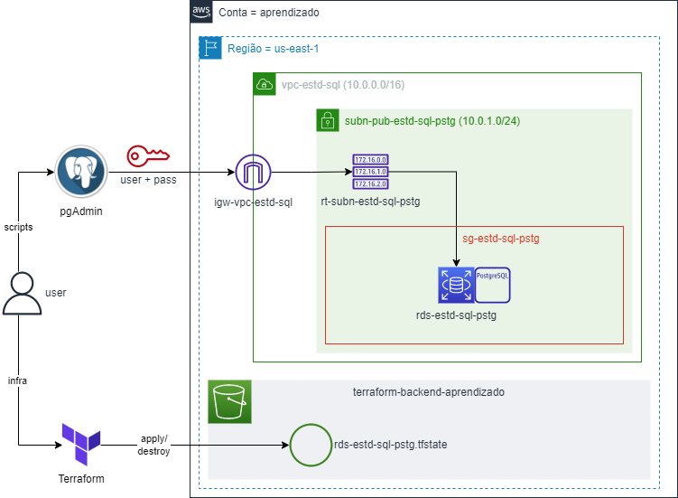
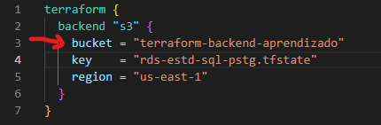
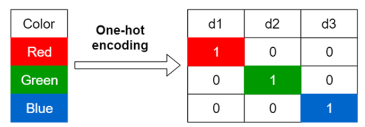

# SQL para Análise de Dados e Data Science

Arquitetura utilizada para os estudos:



* Plataforma = AWS
* SGBD = PostgreSQL
* IDE = pgAdmin
* Infraestrutura = Terraform
* Backend Terraform = S3

## Criando e Destruindo a Infraestrutura

> **Pré-requisistos**
>
> * Instalar o Terraform;
> * Ter uma conta na AWS;
> * Criar um usuário programático no AWS IAM com par de chaves (Secret + Access Key);
> * Conceder acessos de criação de recursos de rede, security group e RDS para o user.

Para criar sua infraestrutura:

* Acesse o arquivo `./infraestrutura/backend.tf` e altere o nome do Bucket onde o tfstate do Terraform será salvo para um bucket pessoal seu;



* Insira sua Access Key e Secret Key no arquivo `meu_computador/seu_usuario/.aws/Credentials`;
* No repositório `./infraesturtura` execute os seguintes comandos:

```bash
terraform init

terraform plan

terraform apply --auto-approve
```

Quando terminar os estudos, destrua a infraestrutura com o seguinte comando:

```bash
terraform destroy --auto-approve
```

---

## Teoria

### Anatomia de uma Query SQL

**Plano de Execução de uma Query**: procedimento/sequência a ser executada (anatomia) em uma query;

* FROM
* ON
* JOIN
* WHERE
* GROUP BY
* WITH CUBE OU WITH ROLLUP
* HAVING
* SELECT
* DISTINCT
* ORDER BY

Porém, a sequência pode variar em alguns casos, como quando o otimizador de consultas do SQL Server usa índices.

---

### Tipos de dados

**Quantitativos**

São aqueles que expressam uma quantidade e podem ser mensurados em escala numérica. Os dados quantitativos podem ser divididos em:

* **Discretos**: resultados de contagens e só assumem valores inteiros;
* **Contínuos**: mensurações que podem assumir qualquer valor real em um intervalo.

**Qualitativos**

Representam características que não podem ser medidas em uma escala numérica, mas podem ser categorizadas ou descritas. São classificados em:

* **Nominais**: representam categorias sem uma ordem implícita. Por exemplo: cor dos olhos (azul, verde, castanho), tipo sanguíneo (A, B, AB, O), marcas de carros (Ford, Toyota, Honda);
* **Ordinais**: representam categorias com uma ordem ou graduação específica. No entanto, a distância entre as categorias não é uniforme ou conhecida. Exemplos incluem níveis de escolaridade (fundamento, médio, superior), graus de satisfação em uma pesquisa (insatisfeito, indiferente, satisfeito) e classificações (primeiro, segundo, terceiro);


---

### Categorização

A categorização em variáveis numéricas, no contexto da análise de dados, refere-se ao processo de transformar dados numéricos contínuos ou discretos em categorias ou grupos discretos. Esse processo é também frequentemente chamado de "binning" ou "bucketing".

A ideia é simplificar a análise ou visualização de distribuições numéricas, ou preparar os dados para algoritmos que operam melhor com dados categóricos.

Razões para categorizar variáveis numéricas:

* **Simplificação de análise**: categorizar dados numéricos pode simplificar a interpretação, especialmente quando há uma grande variedade de valores numéricos;

* **Visualização**: em alguns casos, é mais intuitivo visualizar dados categóricos do que dados numéricos contínuos (Histogramas, por exemplo);

* **Tratamento de Outliers**: a categorização pode ajudar a lidar com outliers, agrupando valores extremos em categorias mais amplas;

* **Preparação para Modelos Específicos**: alguns modelos de machine learning podem exigir, ou operar melhor, com características em vez de numéricas.

O processo de categorização em variáveis numéricas geralmente envolve:

* **Definição de Intervalos**: escolher os limites que definirão as categorias. Isso pode ser feito com base em intervalos de igual tamanho, percentis ou utilizando conhecimento específico do domínio;

* **Transformação**: convertendo valores numéricos nas categorias definidas com base nos intervalos escolhidos;

* **Rotulação (opcional)**: em vez de usar os intervalos como rótulos, pode-se atribuir rótulos mais descritivos às categorias, como "baixo", "médio" e "alto".

---

### Codificação/ Encoding

No contexto da análise de dados e processamento de dados para modelagem preditiva ou machine learning, "codificação" ou "encoding" refere-se ao processo de converter dados categóricos ou textuais em um formato numérico que pode ser usado por algorítmos.

Existem várias técnicas de codificação e a escolha da técnica pode depender da natureza dos dados e do algoritmo específico que se planeja usar. Algumas das técnicas de codificação mais comuns incluem:

* **Codificação One-Hot**: cada categoria de uma variável é convertida em uma nova coluna binária (0 ou 1);



* **Codificação por Rótulo**: cada categoria recebe um valor inteiro. Esta abordagem pode ser problemática para algoritmos que interpretam a natureza ordinal dos números, a menos que haja uma ordem inerente às categorias;

* **Codificação por Frequência ou Contagem**: categorias são codificadas com base em sua frequência ou contagem no dataset. Isso pode ser útil quando uma categoria particular tem significado por sua prevalência, mas pode ser problemático se as frequências forem muito semelhantes entre categorias;

* **Codificação Target**: categorias são codificadas com base na média do valor alvo para essa categoria. Por exemplo, em um problema de classificação binária, as categorias podem ser codificadas pela média de resultados positivos para cada categoria;

* **Codificação Binária**: combina a codificação one-hot e a codificação por rótulo, representando os rótulos codificados numericamente em formato binário;

* **Codificação Baseada em Aprensizado (Embedding Encoding)**: usada principalmente com redes neurais, onde categorias são representadas como vetores densos em um espaço n-dimensional. Estes vetores são aprendidos durante o treinamento da rede neural. Essa técnica é usada em Inteligencia Artificial.

Ao escolher uma técnica, é importante considerar o tipo de modelo a ser usado, a relação entre a característica categórica e a variável alvo, e o potencial de introduzir ruído ou multicolinearidade nos dados.

Em alguns casos, pode ser benéfico experimentar várias técnicas de codificação para determinar qual oferece o melhor desempenho para um modelo específico.

---

### Binarização

No contexto de análise e processamento de dados, refere-se ao processo de converter dados numéricos ou categóricos em formato binário, ou seja, em valores 0 ou 1. Isso pode ser útil por diversas razões, incluindo a simplificação de dados, preparação para certos algoritmos ou até mesmo a extração de características relevantes de imagens em processamento de imagens.


Contextos em que a binarização é aplicada:

* **Análise e Processamento de Dados**: converter variáveis contínuas em formatos binários com base em um limiar. Por exemplo, converter uma variável como "idade" em "maior de 18 anos" (1 se verdadeiro, 0 se falso);

* **Processamento de Imagens**: envolve a conversão de imagens em tons de cinza para imagens binárias, onde os pixels são marcados como 0 (preto) ou 1 (branco) com base em um limiar de intensidade. Isso é útil para o reconhecimento de padrões e outras tarefas;

* **Preparação de Dados para Modelagem**: certos algorítmos, especialmente ous mais simples ou aqueles baseados em árvores, podem se beneficiar da simplificação de dados contínuos em formatos binários. A binarização pode ajudar a destacar relações não lineares entre características e a variável alvo;

* **Engenharia de Características (Feature Engineering)**: as criações de novas características binárias pode ajudar a destacar determinadas relações nos dados. Por exemplo, a partur de uma variável média de renda, criar uma característica binária "renda_acima_da_média" que indica se a renda de um indivíduo está acima da média da amostra.

Ao realizar a binarização, é importante escolher limiares ou critérios apropriados para a conversão, para que a informação útil não seja perdida e para que a transformação seja relevante para o objetivo da análise ou modelagem.